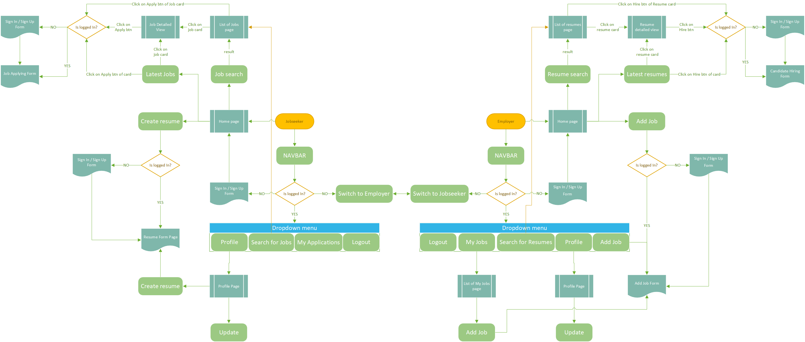
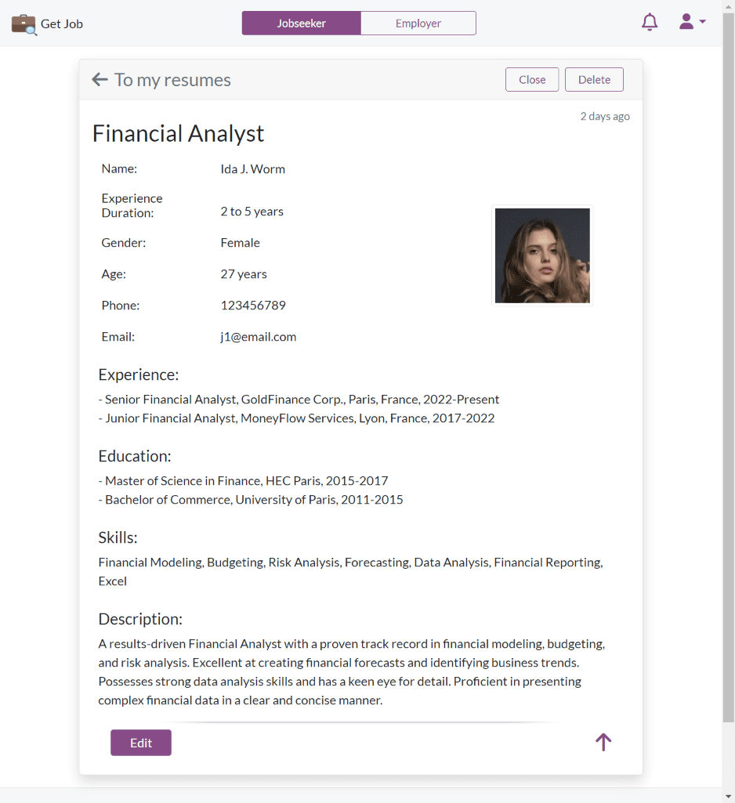
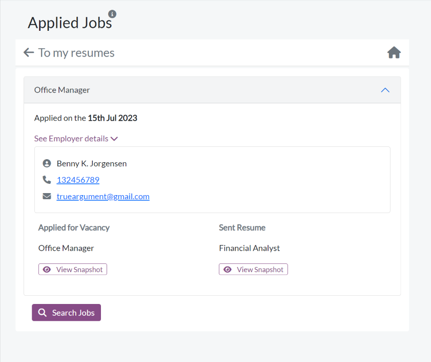
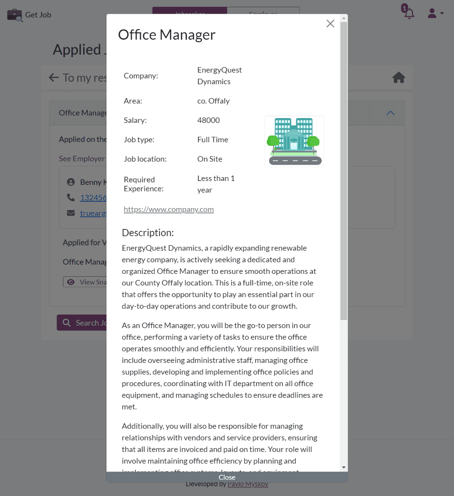
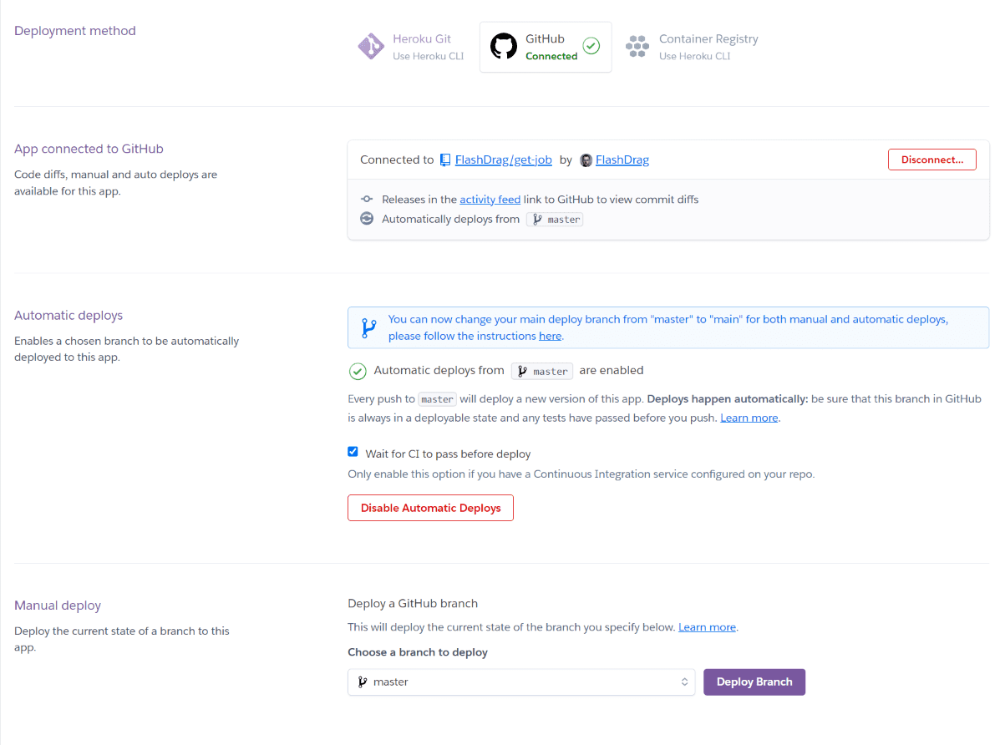

# Get Job

[](https://github.com/FlashDrag/get-job/actions)
[](https://get-job.herokuapp.com)

[](https://docs.djangoproject.com/en/3.2/)
[](https://getbootstrap.com/docs/5.0)
[](https://jquery.com/)
[](https://www.elephantsql.com/)


<!-- TODO Add coverage -->
<!-- [](https://codecov.io/gh/FlashDrag/get-job)

https://github.com/aiogram/aiogram/blob/dev-3.x/.github/workflows/tests.yml
https://about.codecov.io/blog/python-code-coverage-using-github-actions-and-codecov/
-->

## Overview
The relevance of job search in our time constantly increases. [Get Job](https://get-job.live) is an online Job Platform that helps Jobseekers to get desirable jobs and Employers to find the right candidates.
This platform presents two distinct modes: _Jobseeker Mode_ and _Employer Mode_.

The *Jobseeker Mode* equips users with tools to explore job opportunities, apply to open positions, and construct their resumes, all while keeping track of their applications.
Conversely, the Employer Mode empowers employers to advertise vacancies, sift through potential candidates, and hire them accordingly.

The Get Job platform has been intuitively designed, ensuring simplicity and ease of navigation as users engage with the app to fulfill their specific needs. The platform uncovers a broad range of features progressively as users delve deeper into its use. It allows users to manage their data up to the fact that each application or job offer is stored as a snapshot. Thus even if the job is closed or edited, the user can always view the application in the state at the time of submission, as well as Employer can view the Jobseeker's resume at the time of application. Also Get Job provides users with the ability to receive notifications about new job offers(for Jobseekers) and applications(for Employers), as well as to disable email notifications and view notifications only in the app.

Live Demo: https://get-job.live

Heroku: https://get-job.herokuapp.com


## Table of Contents
<!-- TODO -->
...

## Agile Methodology
The main goal of the app is to deliver a solution that creates real value for the users and _UX design_ and _Agile Methodology_ are the best way to achieve this goal.

#### Project Goals
- To help jobseekers get a job.
- To help employers connect with the right candidates.
- To provide a website with a clear purpose.
- To provide a simple and intuitive UI that allows users to easily navigate the app.
- To make the website available and functional on every device, especially on mobile devices, as they are the most popular devices for job search.
- To set up an authentication mechanism that allows users to create their profile, save and manage their data.


### User Stories
#### Jobseeker Goals
- ##### First Time Visitor:
    - As a Jobseeker I want to be able to see the purpose of the app so that I can decide if it is useful for me.
    - As a Jobseeker I want to be able to see the navigation bar so that I can easily navigate the app.
    - As a Jobseeker I want to be able to create a resume so that I can apply for jobs.
    - As a Jobseeker I want to be able to search for jobs so that I can find an appropriate job.
    - As a Jobseeker I want to be able to see the latest jobs so that I be informed about new jobs.
    - As a Jobseeker I want to be able to register an account so that I can build my profile.

- ##### Frequent Visitor:
    - As a Jobseeker I want to be able to see the navigation bar when I scroll the page up so that I can access the navigation bar at any time.
    - As a Jobseeker I want see the dropdown menu so that I can access the most important features of the app.
    - As a Jobseeker I want to be able to log in to my account so that I can manage my data and apply for jobs.
    - As a Jobseeker I want to be able to update my profile so that I can keep my data up to date.
    - As a Jobseeker I want to be able to get push notifications and emails so that I can be informed about new job offers.
    - As a Jobseeker I want to be able to disable email notifications so that I can view notifications only in the app.
    - As a Jobseeker I want to be able to open the appropriate job so that I can see the full job description.
    - As a Jobseeker I want to be able to see a full detailed view of the job so that I can decide if the job is appropriate for me.
    - As a Jobseeker I want to be able to apply for a job so that I can get a job.
    - As a Jobseeker I want to be able to see my applications so that I can manage them.
    - As a Jobseeker I want to be able to log out so that I can protect my data.
    - As a Jobseeker I want to be able to see the number of applicants for a job so that I can see my chances to get a job.
    - As a Jobseeker I want to be able to open the list of all jobs.
    - As a Jobseeker I want to be able to select sort order for the list of jobs so that I can see the most relevant jobs first.
    - As a Jobseeker I want to be able to reset my password so that I can restore access to my account.
    - As a Jobseeker I want to be able to select the searching area in the list of jobs so that I can find jobs in the desired area.
    - As a Jobseeker I want to be able to use the search bar on the page of the full list of jobs.
    - As a Jobseeker I want to be able to reset search parameters so that I can see the full list of jobs.
    - As a Jobseeker I want to be able to see the search panel all the time when I scroll the page so that I can easily search for jobs.
    - As a Jobseeker I want to be able to save a job so that I can apply for it later.
    - As a Jobseeker I want to be able to see my favorite jobs so that I can apply for them later.
    - As a Jobseeker I want to be able to see the list of my resumes so that I can manage them.
    - As a Jobseeker I want to be able to see the Apply and Save buttons on the detailed job page on the mobile screens all the time when I scroll the page so that I can easily apply for a job or save it for later.
    - As a Jobseeker I want to be able to go back to the list of jobs from the detailed job page so that I can continue searching for jobs.
    - As a Jobseeker I want to be able to have access to the search bar on the navigation panel so that I can easily search for jobs at any time.
    - As a Jobseeker I want to be able to delete my account so that I can remove my data from the app.
    - As a Jobseeker I want to be able to see the date when the job was posted so that I can see how old the job post is.
    - As a Jobseeker I want to be able to see all jobs of the particular company so that I can find a job in the company I like.
    - As a Jobseeker I want to be able to see buttons for pagination so that I can navigate through the list of jobs.
    - As a Jobseeker I want to be able to return to the home page from the list of jobs so that I can access the home page at any time.
    - As a Jobseeker I want to be able to see the number of jobs found in the list of jobs so that I can see how many jobs are available based on my search criteria.
    - As a Jobseeker I want to be able to see the footer with the navigation links so that I can easily navigate the app.
    - As a Jobseeker I want to be able to change the password so that I can protect my account.
    - As a Jobseeker I want to be able to reset the password so that I can restore access to my account.

#### Employer Goals
- ##### First Time Visitor:
    - As an Employer I want to be able to see the navigation bar so that I can easily navigate the app.
    - As an Employer I want to be able to toggle the site to employer mode so that I can see the relevant content.
    - As an Employer I want to be able to see the purpose of the app so that I can decide if it is useful for me.
    - As an Employer I want to be able to post a job so that I can find the right candidate.
    - As an Employer I want to be able to register an account so that I can add jobs.
    - As an Employer I want to be able to search for resumes so that I can find the right candidate.
    - As an Employer I want to be able to see the latest resumes so that I be informed about new candidates.

- ##### Frequent Visitor:
    - As an Employer I want to be able to see the navigation bar when I scroll the page up so that I can access the navigation bar at any time.
    - As an Employer I want to be able to login to my account so that I can manage my jobs.
    - As an Employer I want to be able to update my profile so that I can keep my data up to date.
    - As an Employer I want to be able to see my all posted jobs so that I can manage them.
    - As an Employer I want to be able to see applicants for my jobs so that I can select the right candidate.
    - As an Employer I want to be able to open a resume card from the search results so that I can see the full resume.
    - As an Employer I want to be able to see a full detailed view of the jobseeker's resume so that I can decide if the candidate is the perfect match for my job.
    - As an Employer I want to be able can to get push and email notifications so that I can be informed about new applicants.
    - As an Employer I want to be able to disable email notifications so that I can stop receiving emails.
    - As an Employer I want to be able to logout so that I can protect my data.
    - As an Employer I want to be able to open the list of all resumes.
    - As an Employer I want to be able to select the sort order for the list of resumes so that I can see the most relevant resumes first.
    - As an Employer I want to be able to reset my password so that I can restore access to my account.
    - As an Employer I want to be able to use search filters on the list of resumes so that I can find the right candidate.
    - As an Employer I want to be able to use the search bar on the page of the full list of resumes.
    - As an Employer I want to be able to reset search parameters so that I can see the full list of resumes.
    - As an Employer I want to be able to see the search panel all the time when I scroll the page so that I can easily search for resumes.
    - As an Employer I want to be able to hire a jobseeker so that I can get the right candidate.
    - As an Employer I want to be able to see my job offers so that I can manage them.
    - As an Employer I want to be able to save a resume so that I can hire the candidate later.
    - As an Employer I want to be able to see the bookmarked resumes so that I can hire the candidate later.
    - As an Employer I want to be able to see the Hire and Save buttons on the detailed resume page on the mobile screen all the time when I scroll the page so that I can easily hire a candidate or save the resume for later.
    - As an Employer I want to be able to return to the list of resumes from the detailed resume page so that I can continue searching for candidates.
    As an Employer I want to be able to have access to the search bar on the navigation panel so that I can easily search for resumes at any time.
    - As an Employer I want to be able to close/deactivate the job so that I can stop receiving new applications and remove the job from the search results.
    - As an Employer I want to be able to reopen/activate the job so that I can start receiving new applications and the job will be shown in the search results.
    - As an Employer I want to be able to delete the job so that I can remove it from the list of my jobs.
    - As an Employer I want to be able to update the job details so that I can keep the job information up to date.
    - As an Employer I want to be able to delete my account so that I can remove my data from the app.
    - As an Employer I want to be able to style the job description so that I can make it more readable and attractive.
    - As an Employer I want to be able to see the button for pagination so that I can navigate through the list of resumes.
    - As an Employer I want to be able to return to the home page from the list of resumes so that I can access the home page at any time.
    - As an Employer I want to be able to see the number of resumes found in the list of resumes so that I can see how many resumes are available based on my search criteria.
    - As an Employer I want to be able to see the footer with the navigation links so that I can easily navigate the app.
    - As an Employer I want to be able to change the password so that I can protect my account.

#### Moderator Goals
- As a Moderator I want to be able to review and approve the posted jobs so that I can protect the app from inappropriate content.

### Agile Development
This project was developed with the Agile methodology which allowed me to develop the app iteratively and incrementally, and adapt changes with flexibility even in the late stages of development.

_GitHub Issues_ and _Projects_ are used to manage the development process. Each part of the app is divided into _Epics__ which are broken down into _User Stories_ and _Tasks_. An Epic represents a large body of work, such as a feature.

The Project link: https://github.com/users/FlashDrag/projects/9

Each Epic is developed in a separate feature branch and merged to the `develop` for testing and debugging and then mergeg to the `master` branch and deployed to the production server on _Heroku_ using CI/CD. The _master_ branch is always production-ready and all changes are deployed automatically to the production server. This helps isolate the development of each feature and minimize the risk of breaking the production code. The feature branches merged to the _develop_ branch using _Pull Requests_ which allows to review of the code and test the changes with the _CI/CD_ pipeline.

_GitHub Kanban_ board is used to manage the process and track the progress of the development. When _User Story_ is created, it is automatically added to the _Backlog_ column to be prioritized. The product _Backlog_ is never complete, as it is a dynamic document to respond to changes effectively. As new features are identified, they are added to the product _Backlog_. As the product is released, the product _Backlog_ is constantly updated to reflect changes in the product and changes in the market. The Kanban board includes the following columns:
- **Backlog** - the list of all _User _Stories_ that have not yet been scheduled to be completed. As new _User Stories_ are created, they are automatically added to the _Backlog_ column.
- **Sprint Backlog** - the collection of prioritized _User Stories_ that have been selected for the current _Sprint_.
- **Development** - the user stories that are currently being developed.
- **Testing** - user stories that are currently being tested.
- **Done** - all completed and tested _User Stories_.

The Project Table is used to filter and then allocate _User Stories_ to _Milestones_ and prioritize them. At the start of each sprint the _User Stories_ are selected from the _Backlog_ and added to the _Sprint Backlog_ with attached priority labels.
The _User Stories_ prioritized using the _MoSCoW_ method. The prioritisation was based on the following criteria:
- **Must Have** - The _User Story_ is crucial and add significant value to the product and must be delivered in the current iteration.
- **Should Have** - The _User Story_ is important but not critical to the success. Simply delivery is not guaranteed within the current iteration.
- **Could Have** - The _User Story_ is desirable and would only be delivered in their entirety in a best-case scenario. When a problem occurs and the deadline is at risk, one or more could-have items are dropped.
- **Won't Have** - The _User Story_ will not be delivered in the current delivery timebox but may be considered for the future.
The prioritisation based on the 60-20-20 rule where 60% of the effort is spent on the Must Have, 20% on the Should Have and rest 20% on the Could Have. When the Sprint starts, the _User Stories_ are moved to the _Development_ column, where first the Must Have items. When the development of particular _User Story_ is completed, it is moved to the _Testing_ column, tested and then moved to the _Done_ column manually or using the _commit_ message with reference to the User Story ID. If the time is running out and the _User Stories_ are not completed, the Could Have items are dropped back to the _Backlog_ column for the re-prioritisation.


*GitHub Kanban Board*


*GitHub Project Table*


[Back to top](#table-of-contents)

## UX Design
### Structure
The Get Job platform is based on an intuitive and easy-to-use structure. Every page has a consistent layout and navigation to allow users to easily find the information they need. The app has a responsive design to provide an optimal viewing experience across a wide range of devices.

- The Jobseeker's and Employer's Navbar structures are similar but have different purposes. The Jobseeker can search for jobs and the Employer can search for resumes as well as Jobseeker can create a resume and the Employer can create a job post. Also the Jobseeker can manage his profile, created resumes, applied jobs and received job offers and the Employer can manage his account, posted jobs and sent job offers, as well as review the received job applications.
- The index page of the app is a Jobseeker home page which can be toggled to the Employer home page. The Jobseeker and the Employer home page structure is similar. The difference is only in the content of the pages.
- The functionality of the app is limited to the user's role if the user is not logged in. The unauthenticated user can only search for jobs or resumes and have limited access to details of the resumes. The signifcant functionality is available to the authenticated users only. This approach allows to keep the app simple and easy to use for the unauthenticated users and provide the full functionality to the authenticated users. It also keeps the user longer in the app and encourages to register and login. The app's capabilities are being revealed gradually as the user interacts with the app.
- The login and registration pages contains an indentical login form for jobseekers and employers but the user has to select the role before login.
- The List of Resumes and the List of Jobs page structures are identical. The difference is also only in the content of the pages.
- The app also includes separate Detailed view of the Resume and the Job.
- Jobseekers and Employers have their own Profile pages to manage their accounts and view their resumes and created jobs.


### Wireframes
The wireframes were created using [Balsamiq](https://balsamiq.com/). Here are some initial wireframes created at the beginning of the project. The final design may differ from the initial wireframes.

*Jobseeker Home Page*


*Employer Home Page*


*Vacancy List*


*Resume List*


*Vacancy Details*


### UI Design
#### Colour Scheme
The colour scheme of the app is based on two main colours: *royalpurple* - `#874c87` and *cyan-blue* - `#2d7f9b`, and few generic colours: *white* - `#fff`, *black* - `#000`, *grey* - `#6c757d`, and *lightgrey* - `#f5f7f8`. The main colors responsible for the visual separation of type of content and page elements. The Jobseeker's pages are based on the *royalpurple* colour and the Employer's pages are based on the *cyan-blue* colour. The generic colours are used for the text and background elements both on the Jobseeker's and Employer's pages.


#### Typography
The app uses Lato font for all text elements. The font is selected for its unique balance of originality and readability. Originally designed for a corporate client, Lato is the perfect subtle typeface for the business site. Sleek and serious, this font looks professional without coming across as too stuffy. It is legible and works well on the small screens, which is important for the app that is designed to be used on mobile devices. The font is imported using the [Google Fonts API](https://fonts.google.com/).


#### Styling
The app style is consistent across all pages and elements. The app uses a responsive layout to provide an optimal viewing experience across a wide range of devices.

The project style based the [Bootstrap](https://getbootstrap.com/) framework. It allowed me to create a responsive layout with minimal effort and customize the design to my needs. Bootstrap is a free and open-source CSS framework directed at responsive, mobile-first front-end web development. In this app I utilized the source Sass files and customized the Bootstrap variables to create a unique design.

- The Django project is configured to work with the **SCSS preprocessor**. The SCSS files are compiled to CSS files using the [django-sass-processor](https://pypi.org/project/django-sass-processor/) package. The django-sass-processor converts `*.scss` or `*.sass` files into `*.css` while rendering templates. It provides a template tag `` which can be used instead of the built-in templatetag `static`.
The SCSS preprocessors allows to use variables, mixins, functions, and other features that are not available in plain CSS. I customized the Bootstrap variables to create a unique design.
The main SCSS file `main.scss` imports all other custom SCSS files and Bootstrap SCSS files. The `main.css` file is generated from the `main.scss` file and is used in the project. The `_theme.scss` file contains the Bootstrap overrides and custom variables. The `_custom.scss` file contains the all custom styles of the app and based on the SCSS and CSS code.


### Flowchart
The flowchart is simplified version of the app's structure and the relationships between the pages. It does not include all pages and elements as it was created on the early stage of the project and was used as a reference for the development process.



### Database Design
The Get Job platform uses a relational database to store and manage data. The RDBMS used for this project is [PostgreSQL](https://www.postgresql.org/) which is hosted on the cloud service [ElephantSQL](https://www.elephantsql.com/).

The ER Diagram below shows the structure of the database and the relationships between the tables. This diagram was created using [Microsoft Visio](https://www.microsoft.com/en-ie/microsoft-365/visio/).
<!-- TODO -->


[Back to top](#table-of-contents)

## Features
Since the User always visits the site for some content and some purpose, the Features of the app are primarily designed to solve the problems of the Jobseekers and Employers and help them to achieve their goals. The UX is designed to create single-use learning and does not distract users' attention from the main goal - to find a job or a candidate.

### User authentication
To get access to the app's functionality the user has to register and login. The app uses the [Django Allauth](https://django-allauth.readthedocs.io/en/latest/) package to handle the user authentication. The package provides a set of views and templates to handle the user registration, login, logout, password reset and email confirmation.

The Sign In and Sign Up links are available in the navbar dropdown menu for the unauthenticated users. The Sign In and Sign Up pages contain the login and registration forms respectively. The authentication system unified for both jobseekers and employers.

The system uses the email address as the username. The email address is unique for each user and is used to identify the user. The password is used to authenticate the user. The password is stored in the database in the hashed format. The password is not visible to the user and is not stored in the session. The user has to enter the password each time he logs in.

| Jobseeker Sign In | Employer Sign In |
| --- | --- |
|  |  |

- #### Sign In
The app allows users create an account and have additional features that are not available for the anonymous users. To get on the register or login page, the user can click on the `Sign Up/Sing In` button in the Navbar or they will be redirected automatically to the login page when they are trying to access the page that is available only for the logged in users, e.g. *Apply for the Job* page, *Hiring* page, *Create a Job/Ressume* page.
The Sign In page is universal for both jobseekers and employers. It contains the internal navbar and login form. The user type (jobseeker or employer) is set automatically based on the email address.

- ##### Internal Navbar
The internal navbar allows the user to switch between the Sign In and Sign Up pages. Also the user can return to the Home page by clicking the appropriate icon.
- ##### Login Form
The login form contains the *email*, *password*, *remember me*, and *forgot password* fields. The *email* and *password* fields are required. The *remember me* checkbox allows the user to stay logged in after closing the browser. The checkbox is checked by default, so the user can stay logged in for a long time without the need to re-enter the password. The lifetime of the session depends on the [SESSION_COOKIE_AGE](https://docs.djangoproject.com/en/3.2/ref/settings/#session-cookie-age). The default value is 2 weeks.
 The *forgot password* link redirects the user to the Password Reset page.
- ##### Login Redirect
The Sign In form redirects the user to the Home page appropriate to the user type (Jobseeker or Employer) if user came to the Sign In page from the Home page. So, if the user came to the Sign In page from the Jobseeker's Home page, but decided to login with an Employer, the app redirects them to the Employer's Home page after successful login. If the user came to the Sign In page from another page, the app redirects them to the previous page after successful login using the Django's `next` parameter. It is useful when the user tries to access the page that requires authentication, such as the `Apply for Job` page. The user is redirected to the Sign In page, but after successful login the app redirects them back to the Apply for Job form to complete the application.

The authenticated user can have access only to the menu appropriate to the role. So the Jobseeker can not access the options related to the Employer and vice versa. Instead of the Profile button for an authenticated user not associated with his role, the user will see the specific message that the user is logged in as a Jobseeker/Employer and the Logout button.

In case when the unauthorized user tries to access the page during login that requires another role, e.g. the Jobseeker tries to access the Employer's page the app renders the 403 Forbidden page.


- #### Sign Up
The Sign Up page is also universal for both types of users. It contains the internal navbar and registration form.

The form includes the *jobseeker/employer* toggle button, *email*, *name*, *password*, and *confirm password*.

- The *role* field is a choice field with two options - Jobseeker and Employer. The initial role set automatically and depends where user is coming from. If the user is coming from the page related to Jobseeker, the role is set to Jobseeker. If the user is coming from Employer's page, the role is set to Employer appropriately. But the user can change the role by selecting the appropriate option based on radio buttons. The role field is mandatory and the user can not submit the form without selecting the role, as the role tied to the user account and can not be changed later.
- The *email* field is a unique identifier of the user and the system does not allow users to register multiple accounts with the same email address. So the Jobseeker and the Employer can not have the same email address.
- The *name* field is mandatory and should contain the full name of the user. The reason why the app uses only one name field instead of the first and last name fields is internationalization. The app is designed to be used by the users from different countries and cultures. Not every user has the first and last name. For example, in some countries the name consists of three parts - first name, middle name, and last name.
- The *password* field as also required and the user can not submit the form without setting the password. The validation of the password is implemented on the client side and on the server side based on the Django Allauth package.

- ##### Confirmation
The app uses email confirmation to verify the user's email address, that prevents brute force attacks. The user can not login to the app until the email address is verified. The confirmation method based on the combination of the `ACCOUNT_CONFIRM_EMAIL_ON_GET` and `ACCOUNT_LOGIN_ON_EMAIL_CONFIRMATION` parameters of the Django Allauth package. These configuration allows the user to confirm the email address by clicking on the link in the email and then automatically login the user after successful confirmation without the need to login manually.

The confirmation link is valid for 48 hours. If the user does not confirm the email address within 3 days (by default `ACCOUNT_EMAIL_CONFIRMATION_EXPIRE_DAYS=3`), the user has to register again. The invalid link redirects the user to appropriate page with the error message and the link to the Sign In form.

The email verification feature allows the app to use the user email address for the password reset and communication with the user.

- ##### Sing Up Redirect
After successful registration(confirmation) the app redirects the user to Update Profile page to complete the profile, the data of which is used to create job postings or resumes, and then redirects the user to Create Job or Resume page to create the first job post or resume. The redirect is implemented using the Django's custom `get_email_confirmation_redirect_url` method of the `CustomAccountAdapter` class that extends the `allauth.account.adapter.DefaultAccountAdapter`.

It allows to guide the user through the full registration process and helps to avoid the situation when the user registered but did not complete the profile and did not create the first job post or resume for further job/employee search.

In case when a not registered user tries to access the page that requires authentication, such as the `Apply for Job` or `Create Resume` pages the app will not redirect the user back to the same page after successful registration to continue the process as [login redirect](#login-redirect) does, because the user has to complete the profile and create the first job post or resume before applying for the job or hiring the employee and then it requires the administrator's approval.

| Jobseeker Sign Up | Employer Sign Up |
| --- | --- |
|  |  |

| Verification Message | Verification Email |
| --- | --- |
|  |  |

*Invalid Link*


- **Prevent enumeration**
The app prevents the enumeration of the registered users by redirecting all users(registered and unregistered) to the same page with the same message. In our case it's a *Verify Your Email Address* page. This is a security feature to help protect against attacks where a malicious actor tries to discover valid emails by observing the system's response to input. So the app does not allow the user to check if the email address is registered or not. When the user tries to register the account with the email address that is already exists in the system, the app sends the email with message that someone tried to sing up for an account using the user's email address. Also it contains a link to the Reset Password page in case if the user forgot the password. If the `ACCOUNT_EMAIL_VERIFICATION` is not set to `mandatory` in the settings, then the `prevent_enumeration` attribute in the `BaseSignupForm` class set to `False` and the app allows the user to check if the email address is registered or not as the `clean_email` method of the `BaseSignupForm` class raises the `ValidationError` that display the sign up form error message.

It possible to set the `ACCOUNT_PREVENT_ENUMERATION` parameter to `False` in the settings to allow the user to check if the email address is registered or not even if the `ACCOUNT_EMAIL_VERIFICATION` is set to `mandatory`, but it is **not recommended**.

| Validation Error | Email Exists |
| --- | --- |
|  |  |


- #### Logout
The Logout button is available for the authenticated users only and located in the Profile dropdown menu or Sign Up/Sign menu on the page that not associated with current role. When the user clicks on the Logout button, the modal window appears with the confirmation message. The user can confirm the logout by clicking on the Logout button or cancel the logout by clicking on the Dismiss button. After successful logout, the user will be redirected to the Home page.

*Not associated with current role*


*Logout modal window*


- #### Password Reset
The email verification feature allows the user to reset the password using the link in the email.

The reset the password the user has to click on the Forgot Password link on the Sign In page or in the Profile menu of the authenticated user. Then the user will be redirected to the Password Reset page where they have to enter the email address associated with the account. Then the app will send the email with the link to the Password Reset page. On the Password Reset page the user has to enter the new password twice.

*Password Reset*


*Password Reset Email*


*Set New Password*


- #### Change Password
The authenticated user can change the password on the Profile page. The user has to enter the current password and the new password twice. If the user forgets the current password, the user can reset the password using the Forgot Password link that redirects the user to the [Password Reset](#password-reset) page.


- #### Account Deleting
The user can delete(in fact deactivate) their account by clicking on the `Delete` button in the _Delete account_ section of the Profile page. The button redirects the user to the `Confirm Account Delete` page where they must confirm the deletion by entering their password. If the user enters the correct password, the account is deactivated and the app redirects the user to the Home page and displays the message that the account is deactivated and will be deleted in 30 days. So if the user changes their mind, they can contact the app support and reactivate their account. The appropriate message is displayed when the user tries to log in with the deactivated account as well as the app redirects them to the Create Account page.

*Delete Account Confirmation*


*Account Deactivated Message*


[Back to top](#table-of-contents)

## Jobseeker

### All Pages (*except forms)
*The user form pages do not have the main navigation bar and footer. They have the own nav header with the limited navigation links. It allows the user to focus on the form and not be distracted by the other links.*
- #### Navbar
The navigation bar includes the app logo(with link to home page), the toggle button to switch between the Jobseeker's and Employer's Home pages, the Sign-Up / Sign-In dropdown menu with the Sign-Up and Sign-In links for the unauthenticated users and the Profile dropdown menu for the authenticated users.

The Profile dropdown menu contains:
- **Search bar** where the jobseeker can search for job by job title keywords.
- **My Profile** link which redirects to the Profile page where the jobseeker can view and edit his profile.
- **Search for Jobs** link which redirects to the List of Jobs page with the fully functional search panel.
- **Create Resume** link which redirects to the Create Resume form.
- **My Resumes** link which redirects to the Dashboard page with the list of resumes created by the jobseeker.
- **My Applications** link which redirects to the Dashboard page with the list of applications submitted by the jobseeker.
- **Job Offers** link which redirects to the Dashboard page with the list of job offers received by the jobseeker.
- **Saved Jobs** link which redirects to the List of saved Jobs page.
- **Logout** link which logs out the user and redirects to the Home page.

For the authenticated users the NavBar also contains the **Notifications** icon which shows the number of unread notifications and the **Search bar** on the large screens instead of the search bar in the Profile dropdown menu.

The Navbar is fully responsive and the text of the Logo and Sign Up / Sign In buttons as well as the Search bar is hidden on small screens to save space. The Dropdown menu expands to full width on small screens to make it easier to use. In addition, the search bar of the Navbar is moved to the Dropdown menu on small screens to be easily found as it is the main feature of the app.
The Navbar is flexible and always available when the user needs. It hides on scroll down and shows on scroll up. The dropdown menu is also hides on scroll down with the Navbar but not shows on scroll up.
| Mobile navbar | Desktop navbar |
|:---:|:---:|
|  |  |

| Mobile dropdown menu | Desktop dropdown menu |
|:---:|:---:|
|  |  |

The dropdown menu is only available for the authenticated users with the jobseeker role and on the Jobseeker's site pages. When the authenticated user with the Jobseeker role visits the Employer's site, the Profile dropdown menu is replaced with message that the user is currently logged in as a jobseeker and the Sign Out button.


- #### Footer
The footer is simple and permanent. It contains the web app name with the link to the Home page, copyright string with the updateable year and the link to the developer's LinkedIn profile. The footer is responsive and fixed to the bottom of the page if the page content is not enough to fill the page.


[Back to top](#table-of-contents)

### Jobseeker's Home page
The Jobseeker's Home page is designed to help Jobseekers to find a job quickly and easily. The main goal of the home page is to encourage users to create a resume and start searching for a job. As the home page is more demonstrative than functional, it represents the limited versions of the main features of the app to show the users how the app works and what they can do with it.

The page divided into 5 sections: Navbar, Hero, Search panel, Latest Jobs, and Footer.


- #### Hero
The Hero section contains call-to-action headings and a button to encourage users to create a resume. The image of the section conveys the main message of the app - recruiters are looking for candidates reviewing resumes. When the users are clicking on the `Create Resume` button and if they are logged in, then they are redirected to the Create Resume page, otherwise to the Sign-Up / Sign-In. If the user is already logged in as an Employer, then the button is disabled and the tooltip appears with the message that only jobseekers can create resumes.


- #### Jobseeker's Search bar
One of the important features of the app is the search.

The home page contains the search bar with limited functionality.
It is placed in the center of the page to be easily found and allows users to achieve their main goal - to find a job quickly and easily. The functionality of the search bar is the same as the search bar of the Navbar. It takes the user input and searches for the job title keywords in the database. The user will be redirected to the Job Search page with the search results and advanced search panel with passed keywords. It allows the user to use the advanced search panel to narrow the search results. Also the query will be stored in the session until the user types a new query or clears the search bar. The query automatically passed to the search bar each time the user visits the page. To clear the session the user has to click on the `Reset` button of the advanced search panel or clear the search bar and submit the empty query. When the user submits the empty query, the app redirects the user to the Job Search page with the all jobs in the database. The `Filter` button redirects the user to the Job Search page with the advanced search panel and all jobs in the database.


- #### Latest Jobs
The Latest Jobs section is a list of the latest vacancies posted by Employers. Each Vacancy represented by a Bootstrap Card component. The home page contains four active(approved) latest vacancies. The section is fully responsive. On small screens, the cards are arranged in one column and on extra large screens in two columns to be easily readable.

##### Vacancy Card
Each card inclule Job Title, Time since, Company Name, Job Location, Salary, Company Logo, main section of the Job Description and footer with the action buttons.

- **Card Header**
The card header contains Job Title and Time since. The Jobseekers can see the `Applied` badge on the cards of the jobs they have already applied for. The feature based on Django annotations, as the `Vacancy` model initially does not contain the `applied` field.

The Time since represents the custom template filter extends the inherent timesince filter to denote the time elapsed. This filter transforms a datetime object into a string, showing the amount of time in a specific unit since the datetime object was last modified. The datetime object is the `updated_on` field of the `Vacancy` model.

The Job Title is truncated with the Bootstrap class `text-truncate` to meke the cards more compact and presentable.

The Card is fully responsive and the Time since is moved to the bottom of the Job Title on small screens and the Company logo is decreased in size and moved to the top right corner of the card.

**Card Body**
The card body is clickable and redirects the user to the Job Details page. To tell the user that the card is clickable, on the hover the card body is highlighted with the shadow. Also I added the double arrow to the description section, which is kind of a hint that the card is clickable on the small screens.

The description section text is truncated to the 3 lines using custom truncation implemended with Sass. I did not use the Django truncation filter because it truncates the text to the specified number of characters and does not care about the number of lines.

**Action buttons**
- Unauthenticated users
    - The unauthenticated users can also open the details page.
    - The *Save* button is hidden.
    - The *Apply* button redirects the user to the Sign-Up / Sign-In page with the appropriate *toast* message.
- Authenticated users
    The authenticated user with Jobseeker role can save the job to Favorites or directly *Apply for the Job* escaping the Job Details page.
    - The Save feature is implemented with Ajax to avoid page reloading when the user saves the job. The feature also based on the Django annotations, and if the Job already saved, the button is displayed as *Saved*.
    - The Apply button redirects the user to the *Apply for the Job* page even if the user already applied for the job. The reason why the user can always go to the *Apply for the Job* page is that the user can apply for the job using other resume.
- Unauthorized users
    Usually unauthorized users are Employers or other users with the role that does not allow them to apply for the job.
    - The *Apply* button is disabled and the tooltip appears with the message that only Jobseekers can apply for the job.
    - The *Save* button is hidden.


[Back to top](#table-of-contents)

### Job Search page
The Job Search page contains the search results and the advanced search panel. The page is accessible by the search bars of the Navbar and the Home page, by the link in the Dropdown menu of the Navbar and links from some other internal pages of the Jobseeker Dashboard.


- #### Header
The header contains the Back to Home button that redirects the user to the Home page and Found Job Count that displays the number of jobs found by the search query. The Job Count is updated each time the user submits the search query. If there are no jobs found, the counter is changed to the `No jobs found`. The Job word is changed to the Jobs if the number of jobs is more than 1. It is implemented with the `page_obj.paginator.count` and template filter `pluralize`. This approach allows me to avoid using the *if-else* statement and looks more elegant.

- #### Search results
The search results represented by the Bootstrap Cards, the same as the Latest Jobs section on the Home page. Each card is clickable and redirects the user to the Job Details page. The cards are arranged in one column with 6 cards per page. The vacancies is ordered by the `updated_on` field of the `Vacancy` model. The most recently updated or created vacancies are displayed first. Only approved vacancies can be displayed on the Job Search page.

- #### Search panel
The Search page contains the advanced search panel with the search filters including _Job Title_, _Area_, _Job Location_ and _Job Type_. Each filter has a dropdown menu with the list of options. The user can select the options and combine the filters to narrow the search results.
The panel is sticky on large screens and always available when the user scrolls the page. On small screens, the search panel is collapsible to save space. The user can expand it by clicking on the `Tap to Expand Search Panel` button. This panel is collapsed by default if no search query is passed. Otherwise, the panel is expanded and the user can see the search query in the input fields. The Search panel is styled according to the Jobseeker page design.

The search query is stored in the session and the user can see the query in the input fields even if the page reloaded or the user returns to the page after some time. It is overwritten each time the user submits the search query. If the user submits the invalid search query, the panel is expanded and the user can see the form validation errors under the input fields. The search is implemented using `django.db.models.Q` object that allows to combine the search filters with the logical OR operator and make more complex queries. The *Job Title* search query is case-insensitive and the user can search by the part of the word.

The user can reset the search query by clicking on the `Reset` button. The button reset all search queries, remove it from the session storage and update the Job Search page.

All search filters (exept *job title*) are choice fields. It allows the app to validate the user input and improve the search results.
- **Area**
The Area filter is implemented without third-party libraries. The list of areas contains all Ireland counties and the cities that have the same name as the counties, Dublin and its divisions, Northern Ireland, UK, Europe and Worldwide. So the user can search jobs by all Ireland, by counties or by cities. If the user search jobs in particular county, the search results would contain the jobs from the cities of this county if the city in the area list. To search jobs in particular city, the user should select the city from the dropdown menu. But if the user wants to search jobs in Dublin, the user can select Dublin from the dropdown menu and the search results would contain the jobs from all Dublin divisions. This kind of search functionality allows the user to narrow the search results.

- **Job Location**
The Job Location is a choice field that allows the user to search jobs by the location type. It includes 3 options: On Site, Remote and Hybrid. The user can select only one option to narrow the search results.

- **Job Type**
The Job Type contains 7 options and the user is allowed to select only one option: Full-time, Part-time, Contract, Permanent, Temporary, Apprenticeship, Volunteer.


- #### Pagination
The search results are paginated to improve the UX and make the page more user-friendly.
The page paginated by 6 items per page.

Implemented two types of pagination - with the page numbers and with the Previous and Next buttons to give the user the choice:
- The Previous and Next buttons respresented by the Font Awesome icons. Also the user can jump to the first or the last page by using the appropriate buttons with the double arrows.
- The pagination with the page numbers is implemented as _Elided Pagination_, so the user can see the first and the last page at the start and the end of the pagination bar respectively, the current highlighted page at the center and the previous and the next pages on the left and the right sides of the current page. The other pages are hidden with the ellipsis.


[back to top](#table-of-contents)

### Job Details page
The Job Details provides the user with the detailed information about an active job. To access the page, user can click on the Job Card on the Home page or on the Job Search page. It is styled according to the Jobseeker design and based on the Bootstrap cards. The job detail card contains a header, applied indicator, job and company details and logo, footer with the Apply, Save and Top buttons.

- ##### Header
The header contains the Back to job search button that redirects user to the Job Search page and action buttons: Apply and Save.

Back to job search button allows the user to return to the Job Search page on the same search query and continue the job search from the same place. Thus the user doesn't have to scroll the page to get back to where they were before. It is implemented with internal anchor links. The Back to job search button contains the url with the vacancy id `#{{ vacancy.id }}` and each job card has the name attribute with the vacancy id `<a name="{{ vacancy.id }}"></a>`. So when the user clicks on the Back to job search button, the page scrolls to the job card with the vacancy id that is passed in the url.

The Save functionality available only for the authorized users and hidden for the anonymous and other users. It is implemented with the AJAX request and based on the Django annotations, which allows me to annotate vacancies with the `is_saved` field and then display the button state according to the field value.

- ##### Applied indicator
The applied indicator is also based on the Django annotations with the `is_applied` and `applied_on` fields. It allows the user to see if the user already applied for the job and when. The `applied_on` datetime field is converted to the user-friendly format using the custom template filter that extends the `timesince` Django template filter. It shows the unit of time since the user applied for the job. Also, this indicator includes the `See my applications` button that redirects the user to the My Applications page.


- ##### Job details
The job details card contains job title, time since the job was updated, company logo, company name, area, salary, job type, job location, required experience, company website and job description. All type of users can see the job details. The job description is formatted with the `linebreaks` Django template filter to display the text in the paragraphs. The job details card is responsive and expands to full width on small screens. The logo is decreased in size and replaced with the time since, and the time since is moved to the bottom of job title on the small screens.

- ##### Footer
In case the job decsription can be too long on the small screens, the user has access to action buttons in the header and footer of the card. The Top button allows the user to scroll to the top of the page.

*Job Details page*


### Apply for the Job
The user can apply for the job by clicking on the `Apply` button on the Job Card on the Home and Job Search pages or on the Job Details page. The button redirects the user to the `Job application` page.

The page contains the nav header with *To job details* link and Home button, employer details collapsible card, and form with the two sections.

- #### Employer details
The employer details card is collapsed by default and can be expanded by clicking on the `See Employer Details` button link. It includes Employer name, Phone number and email. So the user can contact the employer directly if they have any questions about the job. The phone number and email are clickable and open the default phone and email apps respectively.

- #### Application form
- First of all, the user must select the resume to apply for the job if there any resumes approved by the app support. If the user has no approved resumes yet, they will be prompted to create a new resume or check the all resumes status on the My Resumes page. If the user has approved resumes, they can select the resume using Radio buttons. Also each resume has the `View` button that allows the user to see the resume details or/and edit the resume. The View page is opened in the new tab to prevent the user from losing the data in the application form.
- The second section of the form is the Cover Letter. The user can enter the cover letter text in the textarea. The text is limited to 1000 characters and is not required. The max lenght validation is on the client-side and on the server-side as well. The client-side validation prevents the user from entering more than 1000 characters and the server-side one prevents the user from submitting the form with text longer than 1000 characters. The server-side validation errors are displayed under the textarea. Also there is a `Text Counter` under the textarea that shows the number of characters entered by the user and the maximum allowed number of characters. The counter is updated on each input event regardless of whether the user entered the text using the keyboard or pasted it from the clipboard.

The user can submit the application form only if they selected the resume. Is the user tries to submit the form without selecting the resume, the app displays the default browser validation error message `Please select one of these options`. Also if the malicious user tries to submit the form with disabled JavaScript validation, the server-side validation will still prevent the submission and the user will see the appropriate error message under the resume selection section.

- #### Submitting the form
The user can submit the form by clicking on the `Submit` button. When the user successfully submits the form, the app sends the notification to the employer email and add new application notification to the employer's navbar notification counter. The user redirected back to search results page to the position of the applied job. So the user can continue the job search from the same place. The app also displays the success message using Bootstrap toast component and Django messages framework.

The user can also Reset the form by clicking on the `Reset` button. The button clears the Cover Letter field and uncheck the selected resume. The counter is not reseted but when the user starts typing the text, it is updated.

- #### No active resumes
If the user has no active resumes, the app displays the message with the link to the My Resumes page and the button to create a new resume. The user can create a new resume by clicking on the `Create New Resume` button. The My Resumes link and Create New Resume button open the My Resumes page and the Create Resume page respectively in the new tab to prevent the user from losing the job details page in case the user wants to save the job to apply later.

*Job Application page*


*New Application Email notification*


[Back to top](#table-of-contents)


### Jobseeker's Profile page
The Jobseeker's Profile is accessible from the navbar dropdown menu. The page contains the nav header with the *To Job Search* link and Home button, Profile details, Email notifications, [Change password](#Change-Password) and [Delete account](#Account-Deleting) sections.

- #### Jobseeker Profile details
The Profile details section is designed as the card with the user's avatar, full name, gender, date of birth, address, phone number, email, and the `Edit` button. The user can update their profile details by clicking on the `Edit` button. The button redirects the user to the `Edit Profile` page.

- #### Email notifications
The Email notifications button allows the user to enable or disable the New Job Offers notifications. The button is designed as Bootstrap button with Font Awesome toggler icon inside. The email notifications are enabled by default and the button is green, and the toggle icon is `fa fa-toggle-on`. If the user clicks on the button, the app sends the post request to the server using Ajax and toggles the notifications. It allows the user to enable or disable the notifications without reloading the page. The button is updated to the red color and the toggler icon is changed to the `fa fa-toggle-off` icon.


### Jobseeker Edit Profile
The user can update their profile details on the Edit Profile page. The user can change all details that are displayed on the Profile page except the email. The email is not editable because it is used as the username and is unique. If the user wants to use another email, they must create a new account. The title of the form has the tooltip with the description that appears when the user hovers over the title. It helps the user to understand why they have to provide the details. Running a little ahead, the details are used to generate the resumes.

*I chose this approach because the user can have multiple resumes and the personal data that is included in resumes usually is constant. If the user updates the details on the Edit Profile page, the resumes also updated automatically.*


##### Profile Picture
To store the images of the Jobseekers, I used the [Cloudinary](https://cloudinary.com/) service.
The Cloudinary field uses the Cloudinary API to upload the images to the Cloudinary server and store the image URL in the database. The Cloudinary API provides a lot of functionality to manipulate the images.
For the Jobseekers profile avatars, I used the `gravity` AI feature to crop the images to the square shape based on the face detection. Also, I set `public_ids` based on the user email addresses as the unique identifiers of the images. The names generated from the email addresses using the regex pattern to replace the all non-alphanumeric characters with the underscore. The images resized to the 200x200 pixels and changed the format to the WebP to improve the performance of the app and save the Cloudinary storage space.
Also if the user doesn't upload the image, the default avatar is used.

To validate the uploded data I implemented the custom File validator `jobportal.validators.FileValidator` that checks the image size and format. The validation prevents the user from uploading the images larger than 5MB and the images that are not in the jpeg, png, webp, svg+xml, gif, tiff, bmp, jpg. The custom validator also used for other types of files that are uploaded by the users.
The validator passed to the `to_python` method of the extended `cloudinary.forms.CloudinaryFileField` class. It allows to validate the data before it is converted to the CloudinaryResource object.

[Back to top](#table-of-contents)

- #### Create Resume
The user can create the resume by clicking on the `Create Resume` button in the Hero section, Dropdown menu, My Resumes page or on the Resume Details page. The button redirects the user to the Create Resume page. The page contains the form with the following fields:
    - **Occupation** - the occupation of the is the title of the resume.
    The field is required but not unique. The occupation is used as the resume identifier and is displayed on the My Resumes page, on Resume cards, email notifications and so on. It it used in search queries to find the resumes.
    - **Experience duration** - is a choice field with the predefined choices: _Less than 1 year_, _1-2 years_, _2-5 years_, _5-10 years_, _10+ years_. The field is required and the user must select one of the options.
    - **Skills** - is a text field that allows the user to enter the skills. The field is required. The user can enter the skills separated by the comma. The skills are used in search queries to find the resumes.
    - **Education** - is a text field that allows the user to enter the education. The field is not mandatory.
    - **Experience** - is a text field that allows the user to enter the experience. The field is not mandatory.
    - **About** - is a text field that allows the user to enter the information about themselves. The field is required and must be minimum 100 characters long. The field is presented in job cards and set as mandatory to provide the information about the jobseeker to the employers in the short form in search results. So the user can build the first sentence so that it is more attractive to employers.
    - **CV** - is a file field that allows the user to upload the CV. The field is not required. The CV is used to provide the additional information about the jobseeker to the employers. The CV uses the same custom validator as the profile picture but with other parameters. The max file size is 512KB and the allowed formats are pdf, doc, and docx. The CV is not displayed on the Resume cards and it accessible only on Hiring page or in Employer's dashboard if the employer sent the job offer to the jobseeker or the jobseeker applied for the employer's vacancy.

Once the user submits the form, the app creates the resume and redirects the user to My Resumes page. The user can see the new resume in the table. The resume has the _In Review_ status by default and must be approved by app administration.


- #### My Resumes
The user can create multiple resumes and manage them on the [My Resumes page](#my-resume-details). For example, the user can create the resume with the occupation `Frontend Developer` and `Backend Developer` to increase the chances to be found by the employers. The page contains the table of the current Jobseeker resumes. Each row of the table represents the resume and includes the Resume Title(Ocupation), the Resume Status, the Last Updated date and the Action buttons.
- ##### Resume Title
The Resume Title is clickable and redirects the user to the Resume Details page. The title is truncated to 40 characters to fit the table cell and be more readable on small screens. Each word of the title is line-breaked to the new line on small screens, but if the title contains the long word, the table cell is expanded to fit the word until it will be truncated. Then if the table is too wide, the horizontal scrollbar appears.
- ##### Resume Status
The Resume status indicates the current status of the resume. The status can be _In Review_, _Rejected_, _Active_ or _Closed_. The row color depends on the status. The _In Review_ status is yellow, the _Rejected_ status is red, the _Active_ status is green and the _Closed_ status is gray. Each status has the appropriate tooltip with the description that appears when the user hovers over the icon.

- _Active_ status means that the resume is approved by the admin and is visible to the Employers.
- _In Review_ status is set by default when the user creates or updates the resume details. The resume is not visible to the Employers until it is approved by the admin. The admin can approve or reject the resume on the Admin dashboard. The resume status is changed to _Active_ if the admin approves the resume or to _Rejected_ if the admin rejects the resume.
- _Rejected_ status means that the resume does not meet the requirements or contains the inappropriate content.The user can update the resume details and submit it again. The resume status is changed to _In Review_.
- _Closed_ status means that the resume is closed by the user and is not visible to the Employers. It cannot be updated until the user reopens it.

If the Jobseeker applied for the vacancy when the resume had an `Active` status and then closed or edited the resume, the employer still will be able to see the resume details snapshot in the Applications section of the Employer's dashboard. The snapshot contains full resume details on the moment of application except Jobseeker personal details that are tied to the Jobseeker profile and can be updated by the Jobseeker. Once the Jobseeker decides to delete the resume or profile, all applications together with the resume snapshots will be deleted from the database. It allows the Jobseekers to control what information is available to the Employers and vice versa.
- ##### Last Updated
 The Last Updated date converted to the user-friendly format by custom template filter and displayed as time since. E.g. _2 days ago_ or _1 month ago_.
- ##### Control
The Control buttons allow the user to manage the resume. The user can edit the resume details, delete the resume or close the resume. The _Edit_ button redirects the user to the Resume Update page. All resumes except the _Closed_ resumes can be edited. The _Close_ and _Delete_ buttons open the modal window to asks the user to confirm closing/deletion. Once the user has confirmed the action, and the table is updated and an appropriate message shown. The _Close_ button changed to _Open_ and the resume status is changed to _Closed_. The user can reopen the resume, update and display it to the employers again. Once the resume was reopened, it gets the _In Review_ status by default, so the user can update it or/and wait for approval. Only the _Active_ resumes will be shown in the search results and can be viewed by the Employers.

**Create New Resume** button redirects the user to the Resume Create page where they can create the new resume. The user can have only up to 5 resumes. If the user tries to create the new resume when they already have 5 resumes, the app redirects them to the My Resumes page and displays the appropriate modal alert. So the user can delete the old resume to create the new one.


- ##### My Resume Details
The Resume Details page is available from the My Resumes list. The page content is identical to the [Resume Details](#resume-details) page content for the Employers, but has the different color interface (jobseeker style) and the different header and footer buttons. The user can update the resume details, close or delete the resume using the appropriate buttons. These buttons have the same behavior as the buttons on the My Resumes page.



- ##### Update Resume
The user can update the resume details on the Resume Update page. The form is accessible from the My Resumes page and from the Resume Details page. The form is identical to the [Create Resume](#create-resume) form (**it uses the same Django form class, but now is bound to the existing resume instance**), but the user can see the current resume details and edit them. When the user submits the form, the app updates the resume and redirects the user to the My Resumes page. The updated resume has the _In Review_ status by default and must be approved by app administration.


[Back to top](#table-of-contents)

- #### My Applications
The My Applications page is available from the Jobseeker's Dropdown menu.
My Applications is the page where the user can view the list of the applications that they have submitted. Each application is represented by Bootstrap Accordion component collapsed by default. The Accordion header represented by the Job Title, so the user can easily find the application that they need. The user can expand the element to view the application details.
These details include application date, employers details, vacancy title and button to view the snapshot, resume title and snapshot button.

##### Snapshot functionality
The snapshot functionality allows the user to view the resume/vacancy details that were submitted with the application. The snapshot is the copy of the resume/vacancy details on the moment of application, except user personal details that stored in the Profile DB table. The snapshot is stored in the Application in the JSON format. The snapshot view based on the Ajax request to the server. The app sends the Ajax request to the server, and the Django view renders the resume/vacancy page from the json snapshot that is stored in the application instance and return as a JsonResponse. Then the Ajax success callback function inserts the response into the Bootstrap modal window and opens it. It allows the user to view the resume/vacancy details quickly without leaving the page.

The snapshot modal window is fully responsive and has the same structure as the resume/vacancy details page. The modal window has the two close buttons: one on the top and one on the bottom of the modal window. The top close button is fixed and always visible.



*Vacancy Snapshot Modal*


- #### Job Offers
The Job Offers page is available from the Jobseeker's Dropdown menu.
The Job Offers page represents the list of Jobseeke's resumes with the sublists of the job offers that the user has received from the Employers for their resumes. Each card is an Accordion element that is collapsed by default.

The Accordion header is represented by the Resume title and Offer counter( the number of offers that the user has received for the resume). The user can expand the Accordion element to view the list of job offers.

The body of the Accordion card contains the list of job offers. Each job offer includes the clickable Job Title that displays the Job Details snapshot in the modal window, the Employer details icon that opens the Employer Details modal window, and the Employer's message, which also can be viewed in the modal window. The employer details and message modal windows can be switched by the appropriate buttons. Also, the user can view the Resume snapshot that is stored in the job offer. The Resume snapshot is displayed in the modal window and has the same structure as the Resume Details page. Each offer contains the date when the offer was sent. The snapshot views is implemented using the Ajax requests. The snapshot modal example can be found in the [My Applications](#my-applications) section.


*Employer Details Modal*


*Employer Message Modal*


[Back to top](#table-of-contents)

- #### Saved Jobs
The user can save any job to the Favorites by clicking on the `Save` button on the Job Card or on the Job Details page. All saved jobs can be viewed on the Saved Jobs page that is available from the Jobseeker's Dropdown menu only for the authenticated users. The page contains a list of the saved jobs. Each row of the list represents a job and is clickable. So the user can view the job details by clicking on the job title. The link redirects the user to the Job Details page. Also the row contains Action buttons that allow a user to remove the job from the Favorites or directly apply for the job. The removing action does not require the confirmation, as this action is not critical. The QuerySet of the saved jobs is annotated with `is_applied` field that indicates if the user has already applied for the job. The field is used to display the appropriate button state on the each row.


- #### Notifications
When the Employer sends the job offer to the Jobseeker, the app sends the email and internal app notifications to the Jobseeker.

- #### Email Notifications
Email message contains the Job Title, Employer's name and email, and the title of the Resume that the employer has selected. The email message has the link to the Job Offers page, so the user can view the job offer details by clicking on the link. The email message is sent to the Jobseeker's email address that was provided during the registration.

- #### Internal App Notifications
The internal app notification represented by the FontAwesome *Bell* icon with the *Badge* that displays the number of unread notifications. The badge is displayed only if the user has unread notifications. The badge is updated only when the user updates the page.

The user can view the list of notifications by clicking on the *Bell* icon. The list of notifications is represented by the Bootstrap Accordion component. The compponents ordered by two criterias: the first is if the notification is read or not, the second is the date when the notification was created. The unread notifications are displayed first in descending order. Each unread notification is expanded by default and has the yellow header. The read notifications are collapsed by default and have the white header. When the user clicks on the header of the unread notification, the notification is marked as read, header color is changed to white, the element is collapsed and Navbar *Bell* icon badge is updated. These functionality is implemented using the Ajax and allows the user to mark the notification as read without redirecting and page reloading. The user also can mark all notifications as read by clicking on the *Mark all as read* button. The button is displayed only if the user has unread notifications. This method triggers the page reloading.

The notification body contains the short description of the notification with the Employer name and date when the offer was sent. The user can view the Employer message by clicking on the *View Message* button. The button opens the modal window. Also the user can view the Vacancy and Resume snapshots that represent the copy of the Vacancy and Resume details on the moment when the offer was sent. The snapshots are displayed in the modal window and have the same structure as the Vacancy and Resume Details pages. The snapshots are implemented using the Ajax requests.


*New Job Offer Email Notification*


*Unread Notification*


*Message Modal*


*Vacancy Snapshot Modal*


[Back to top](#table-of-contents)

### Employer's Home page
The Employer's has similar to the [Jobseeker's Home](#jobseekers-home-page) page structure. It contains NavBar, Hero, Employer's Search bar, and the list of the latest Resumes.
- #### Navbar
The Employer Navbar contains the Logo, Jobseeker/Employer toggle button with the appropriate links to the Jobseeker's and Employer's Home pages, search bar, notifications icon, and the dropdown menu.

- The search bar is used to search resumes by occupation and skills keywords.
- The Notification icon is used to display the number of unread notifications.
- The dropdown menu contains the links to the My Profile, Search Resumes, Post a Vacancy, My Jobs, My Job Offers, Recruitment Dashboard, Saved Resumes, and Logout button.

- #### Hero
The Hero image presents the Employer's Home page and contains call to action button that redirects the to the Post a Vacancy page. If the user not authenticated, the button redirects the user to the Login page. If the user is not authorized to post a vacancy, the button displays the tooltip with the message that only the Employer can post a vacancy.

- #### Employer's Search bar
The search bar is used to search resumes by occupation and skills keywords. The search bar is the same as the [Jobseeker's Search bar](#jobseekers-search-bar) and has the same functionality but searches resumes instead of jobs. It contains two butttons which redirects the user to the Resume Search page. The Filter button redirects the user to the Resume Search page without any search query. So if the search query was in the session storage it will be passed to the Resume Search page. The Find Resume button redirects the user to the Resume Search page with the search query that was provided by the user. If no search query was provided, the user will be redirected to the Resume Search page with empty search query and the the Search Page page will display all resumes.

- #### Latest Resumes
The Latest Resumes section contains the list of the latest resumes. The Home page displays the latest 4 approved resumes.

Each resume respresented by Bootstrap card. The card is similar to the [Vacancy Card](#vacancy-card). It contains the Offered badge if the Employer has sent the job offer to the Jobseeker for this resume, Resume title(Occupation), Date when the resume was created or updated, Jobseeker Profile image, Jobseeker name, Experience duration, the list of the Jobseeker skills and body text that contains the short description of the Jobseeker. All fuctionality is the same as the [Vacancy Card](#vacancy-card) with the exception of the Hire button that redirects the user to the Send Job Offer page.


[Back to top](#table-of-contents)

### Resume Search
The basic structure of the Resume Search page is the same as the [Job Search page](#job-search-page).

- #### Search bar
The Resume Search bar contains the Occupation and Skills keywords input, Experience range selector, Gender and Age range.

- ##### Age range selector
As the multiple sliders are not supported by the Bootstrap, I used the [jQuery UI Slider](https://jqueryui.com/slider/) to implement the Age range selector.

The Age range selector allows the user to select the age range of the Jobseeker. The age range is represented by the two sliders. The user can select the age range by dragging the slider handles or by clicking on the slider bar. The selected range is displayed in the Age range decorative input field. The input field is read-only and disabled. To capture the slider state and insert it into the form I implemented the hidden input fields that are part
of the Django Form. It allows me to validate the inputed by the user age range using server side django validation if the malicious user is trying to force a value change of the hidden input fields or set an invalid value into the search query in the url.


### Resume Details
The Resume Details card contains Header with To resume search button, Hire and Save buttons, body with the Jobseeker details, and Footer with the Action buttons. The card is similar to the [Vacancy Details card](#vacancy-details-card) with the exception of the Hire button that redirects the user to the Send Job Offer page and content of the body.

The Resume details include the Jobseeker Occupation, Profile picture, Name, Experience duration, Gender, Age, Phone number, Email address, Experience description, Education, Skills, and Body text. The personal information(gender, age, phone, email) is displayed only for Employer users.


### Hiring page
The app allows the Employer to send a job offer to the Jobseeker by using the Hiring page. The Hiring page is accessible from the Resume card and the Resume details page. The Hiring page contains Jobseeker name with Occupation, List of Employer's Vacancies, and the Job offer message input field. The Employer can select the vacancy from the list of his vacancies, view the vacancy details(opens in the new tab), and send the job offer message to the Jobseeker. The Job offer message is optional and cannot be longer than 1000 characters. If the Employer does have any active vacancies, they will be prompted to create a vacancy or go to the My Vacancies page to check the status of the vacancies. The My Vacancies and Create Vacancy pages open in the new tab to allow the user go back to the Hiring page and save the job offer message or job itself to apply for it later.

When the Employer sends the job offer, the system creates Vacancy and Resume snapshots and store them in JSON format in JobOffer database table. So the Jobseeker and Employer can view the vacancy and resume details at the time when the job offer was sent. Also the app sends the [email notification and in-app notification](#notifications) to the Jobseeker with the job offer details and the link to the Hiring page.


[Back to top](#table-of-contents)

### Employer Profile
The Employer Profile page accessible from the dropdown menu. The page contains the Employer details (Employer name, Company name, Company logo, Company website, Phone number and Email address) that can be updated by the Employer clicking on the Edit button. From the page the Employer can also [Disable Email Notifications](#email-notifications) that enabled by default, [change password](#change-password), and [delete account](#account-deleting).


- #### Update Employer details
The user can update the Employer details by clicking on the Edit button. The page will display the same fields as the Employer Profile page. The fields are prefilled with the current Employer details. The user can update the details and save the changes by clicking on the Submit button. After the changes are submitted, the user will be redirected back to the Employer Profile page.


[Back to top](#table-of-contents)

### Create Vacancy
The Create Vacancy page accessible from the dropdown menu, Post a Job button on the Home page, and My Vacancies page. The page contains the form with the fields that allow the Employer to create a new vacancy. The form contains the Title, Area, Job Location, Job Type, Salary, Experience duration and Job Description fields. More details about the fields can be found in the [Vacancy Card](#vacancy-card) section.

After the vacancy is created, the Employer will be redirected to the My Vacancies page. Before the vacancy will be displayed on the Job Search page, it has to be approved by the Admin. The Admin can approve or reject the vacancy from the Admin panel if the vacancy does not meet the requirements.


### My Vacancies
The My Vacancies page accessible from the dropdown menu and has identical structure and functionality as the [My Resumes](#my-resumes) page. The page contains the list of the Employer's vacancies with the status badge, title last update date, and the Action buttons. The Action buttons allow the Employer to edit, close, and delete the vacancy. Only the vacancies with the status `Active` shown on the Job Search page and can be used to send a job offer to the Jobseeker. The total number of vacancies the Employer can create is limited to 5. If the Employer has 5 active vacancies, they will not be able to create a new vacancy until deletes one.


[Back to top](#table-of-contents)

### Job Offers
The Job Offers page represents the list of the Job Offers sent by the Employer to the Jobseeker. Each Job Offer is a Accordion card that contains the clickable header with Jobseeker Occupation and email, and the body with the submittion date, Jobseeker Resume snapshot and Vacancy snapshot. More details about the snapshots can be found in the [Snapshot functionality](#snapshot-functionality) section of the My Applications page.


*Vacancy snapshot*


### Recruitment Dashboard
The Dashboard allows the Employer to view the statistics of the Posted Jobs. The page page containt list of the Employer's vacancies with sublists of the Jobseekers resumes that applied for the vacancy. Each list represended by the Accordion card with header that contains the Vacancy title and the number of the Jobseekers that applied for the vacancy. The body of the card contains the list of the Jobseekers resumes title(clickable) that includes the Occupation and the email address, and the Action buttons. The Action buttons allow the Employer to download the Jobseeker CV and View the Cover Letter. The Cover Letter is a text message that the Jobseeker can send to the Employer with the job application. Also the Employer can view the Resume and Vacancy snapshots that were created at the time when the Jobseeker applied for the vacancy.


### Saved Resumes
The Saved Resumes page represents the list of the Jobseekers resumes that were saved by the Employer. The page has identical structure and similar functionality as the [Saved Jobs](#saved-jobs) page.


### Notifications
The app notifications are used to notify the Employer about the new job applications. When the Jobseeker applies for the vacancy, the Employer will receive an email and in-app notifications. The email one contains job title, applicant name and ocuppation and applicant email, and link to the Applications Received page. The in-app notification represented by the bell icon in the navbar with the number of the unread notifications. When the Employer clicks on the bell icon, they will be redirected to the Applications Received page.

The Application Received page contains the list of Accordion cards. Each card represents the Jobseeker that applied for the vacancy. The card header contains the Vacancy title. The card body contains the Jobseeker name, date of the application, and the Action buttons. The Employer can view the Cover Letter and download a CV. Also the Employer can view the Vacancy and Resume snapshots that were created at the time when the Jobseeker applied for the vacancy.

The Notification cards with unread notifications have the blue background and displayed on the top of the list. To mark the notification as read, the Employer has to click on the Accordion card header. After the notification is read the card background will be changed to white and notification counter on the bell icon will be decreased by one. This functionality implemented using Ajax requests. It allows the Employer to read the notifications without reloading the page.


*Cover Letter on the Application Received page*


[Back to top](#table-of-contents)

### Admin Panel
<!-- TODO: moderation -->

### Future Features
<!-- TODO -->

### Development Features
- #### Role System
To manage the different types of users, I created Custom User Model and implemented a role system.
The app contains two main types of users - Jobseekers and Employers. So the system allows users to create an account as a Jobseeker or an Employer. All the time when we want to create a new user, we have to assign him to a role. The email address is used as a unique identifier of the user and the system does not allow users to register multiple accounts with the same email address. So the Jobseeker and the Employer can not have the same email address.

The role system was implemented by adding a `role` field to the `User` model. The `role` field is a choice field with options `Admin`, `Jobseeker`, and `Employer`. The `role` field also provides access to the appropriate pages, features and content of the app. For example, the Jobseeker can not create a job post and the Employer can not apply for a job.

- #### Branching Strategy
The app was built using the _Feature_ branching strategy. The strategy allows me to create a branch for a specific feature, task or bug without affecting the `master` branch, which keeps the main codebase clean and stable.

I have two main branches - `master` and `develop`. Whenever I want to add a new feature, I create a new branch from the `develop` branch. Then I develop the feature and when it is ready, I create a pull request and merge the `feature` branch into the `develop` branch. Before merging, the code is processed by the Continuous Integration (CI) system to check the code quality and run tests. Then the branch is deployed to the Heroku staging environment for manual testing. When the testing is completed, I pull the latest changes from the remote `develop` branch to the local `develop` branch and merge it into the local `master` branch. Then I push the local `master` branch to the remote `master` branch which triggers the GitHub Actions CI system to run tests. When the CI system successfully completes the checks, the branch is deployed to the Heroku production environment. The strategy allows me to keep the `master` branch clean and stable and test the app before it is deployed to the production environment.

See the [Deployment](#deployment) section for more details about the CI/CD process.

|Branching Strategy|
|:--:|
||

- #### Database
The app uses a relational database service [ElephantSQL](https://www.elephantsql.com/) to store and manage data. In this project I used 3 databases - `local`, `staging`, and `production`. The `local` database is used for local development and testing. It's a SQLite database that is provided by Django. The `staging` and `production` databases are PostgreSQL databases that are provided by ElephantSQL. The `staging` database is used for testing the app before it is deployed to the production environment.

*Database Configuration for different environments*
```
development = os.getenv('DEVELOPMENT', False) == 'True'

if development:
    DATABASES = {
        'default': {
            'ENGINE': 'django.db.backends.sqlite3',
            'NAME': BASE_DIR / 'db.sqlite3',
        }
    }
elif len(sys.argv) > 0 and sys.argv[1] != 'collectstatic':
    if os.getenv("DATABASE_URL", None) is None:
        raise Exception("DATABASE_URL environment variable not defined")

    import dj_database_url
    DATABASES = {
        'default': dj_database_url.config(
            default=os.getenv('DATABASE_URL')
        )
    }
```

*ElephantSQL Instances for different environments*


- #### Static Files
The app uses the [Cloudinary](https://cloudinary.com/) cloud service to store static files such as images, CSS, and JavaScript files and media files such as user avatars, CVs, and company logos. Initially, I used the [AWS S3](https://aws.amazon.com/s3/) cloud service to store static files. But the free tier of the AWS S3 service includes 5 GB of storage, 20,000 Get Requests, and 2,000 Put Requests. It was not enough for my project, especially put requests. Contrary to popular belief, setting up Amazon S3 was far from difficult.
In fact, one major benefit of Amazon S3 is the ability to create a new bucket for each application, ensuring better organization and conflict-free storage. However, I decided to use Cloudinary even it provides a single 'bucket' for all my applications. I managed to figure out and set up Cloudinary for several projects without any issues. Each project has its own folder in the Cloudinary media library.

*Cloudinary Management - Static Files*


*Cloudinary Management - Media Files*


## Technologies Used
- ### Languages
    - [HTML5](https://en.wikipedia.org/wiki/HTML5)
    - [CSS3](https://en.wikipedia.org/wiki/CSS)
    - [JavaScript](https://en.wikipedia.org/wiki/JavaScript)
    - [Python](https://en.wikipedia.org/wiki/Python_(programming_language))
- ### Frameworks, Libraries
    - [Django 4.2](https://docs.djangoproject.com/en/4.2/)
    - [Bootstrap 5](https://getbootstrap.com/docs/5.3/getting-started/introduction/)
    - [jQuery 3.6.4](https://releases.jquery.com/)
    - [jQuery UI 1.13.2](https://jqueryui.com/)
    - [Font Awesome 6.4](https://fontawesome.com/)
    - [Google Fonts](https://fonts.google.com/)
    - [libsass](https://pypi.org/project/libsass/)
    - [coverage](https://coverage.readthedocs.io/en/7.2.7/)

- ### Tools
    - [Git](https://git-scm.com/)
    - [GitHub Actions](https://docs.github.com/en/actions)
    - [Heroku Pipelines](https://devcenter.heroku.com/articles/pipelines)
    - [Microsoft Visio](https://www.microsoft.com/en-ie/microsoft-365/visio/)
    - [Cloudinary](https://cloudinary.com/)
    - [Balsamiq](https://balsamiq.com/)
    - [Sass](https://sass-lang.com/)

- ### Django packages
- [django-crispy-forms](https://django-crispy-forms.readthedocs.io/en/latest/)
- [cripsy-bootstrap5](https://github.com/django-crispy-forms/crispy-bootstrap5)
- [django-allauth](https://django-allauth.readthedocs.io/en/latest/)
- [django-compressor](https://django-compressor.readthedocs.io/en/stable/)
- [django-sass-processor](https://pypi.org/project/django-sass-processor/)


## Testing
See [TESTING.md](https://github.com/FlashDrag/get-job/blob/master/docs/TESTING.md) for an overview of the app testing and debugging.

## Deployment, CI/CD
The Get Job platform is deployed on the [Heroku](https://www.heroku.com/) cloud platform and can be accessed here https://get-job.live.
The _get-job.live_ domain is registered with [Name.com](https://www.name.com/) and uses uses the [Heroku DNS service](https://devcenter.heroku.com/articles/custom-domains) to point to the Heroku app. Usually Heroku free dyno plan does not support [SSL certificates for custom domains](https://devcenter.heroku.com/articles/ssl#dynos-and-certificate-options). But they provides a free ssl certificate for the _herokuapp.com_ domain. So the dyno is upgraded to the Hobby plan to enable the ssl certificate for the custom domain.

*heroku ssl certificates*


*Domain DNS settings - heroku.com*


*Domain DNS settings - name.com*


- #### SSL Redirect
SSL Redirect is enabled in the Django settings to automatically redirect all http requests to https in the production environment.
```
development = os.getenv('DEVELOPMENT', False) == 'True'

if development:
    SECURE_SSL_REDIRECT = False
    SESSION_COOKIE_SECURE = False
    CSRF_COOKIE_SECURE = False
else:
    # redirect from http to https
    SECURE_PROXY_SSL_HEADER = ('HTTP_X_FORWARDED_PROTO', 'https')
    SECURE_SSL_REDIRECT = True
    # set session and csrf cookies to secure
    SESSION_COOKIE_SECURE = True
    CSRF_COOKIE_SECURE = True
```

The build, test, and deployment processes of the app are _automated_ using Continuous Integration based on [GitHub Actions](https://docs.github.com/en/actions) and Continuous Deployment based on [Heroku Pipelines](https://devcenter.heroku.com/articles/pipelines).

- #### Continuous Integration
The GitHub repository is configured to use automated _Continuous Integration_ workflows. The workflow is triggered when a pull request is created and merged into the `develop` and/or `master` branches. When the workflow is triggered, it performs the build, lint, and test tasks.

*GitHub Actions CI workflow*


- #### Continuous Deployment
The _Continuous Deployment_ workflow is implemented using [Heroku GitHub Integration](https://devcenter.heroku.com/articles/github-integration). This feature allows me to connect the app to a GitHub repository and deploy the app automatically from the selected branch when a new commit is pushed to the repository. The GitHub integration also supports the option to [wait for CI to pass before deploying](https://devcenter.heroku.com/articles/github-integration#automatic-deploys) the app. So the app is deployed automatically only when the build and test tasks are passed.

*Heroku GitHub Integration and Automatic Deploys*


[Heroku Pipelines](https://devcenter.heroku.com/articles/pipelines) is used to implement the _Continuous Deployment_ workflow. The pipeline is configured to deploy the app to the two environments - _Staging_ and _Production_:
1. The _Staging_ stage is used to preview code changes and features before being deployed to production. This stage is triggered when a new commit is pushed to the `develop` branch or a pull request is merged into the branch from the feature branches. The app is deployed to the Heroku staging environment automatically when the tests are passed. The staging environment is available here https://get-job-dev.herokuapp.com.
2. The _Production_ stage is a live environment for the app. It is triggered when a new commit is pushed to the `master` branch. It also deploys the app automatically when GitHub Actions CI is passed. The production environment is available by the link https://get-job.herokuapp.com.


#### Deployment process
<!-- TODO -->


## Credits
- ### Code
The Get Job platform is based on my own implementation of code, applying what I have learned from the [Code Institute](https://codeinstitute.net/) Full Stack Software Development course and other educational resources.

- ### Content
    - Logo and favicon Briefcase from https://icons8.com
    - Hero image of the jobseeker page designed By agny_illustration from https://pngtree.com/freepng/modern-flat-design-concept-of-recruitment-presentation-for-employment-and-recruiting-application-for-employee-hiring-can-used-for-web-banner-infographics-landing-page-flat-vector-illustration_5332898.html?sol=downref&id=bef
    - Hero image of the employer page designed by pikepicture from https://pngtree.com/freepng/recruitment-process-vector-human-resources-choice-of-candidate-employee-office-chair-vacancy-executive-search-recruiting-hiring-hr-isolated-illustration_5190146.html?sol=downref&id=bef?sol=downref&id=bef
    - Branching Strategy diagram is taken from [ci-cd-pipelines-react-github-actions-heroku](https://blog.logrocket.com/ci-cd-pipelines-react-github-actions-heroku/) blog post.
    - Placeholder Company image by <a href="https://pixabay.com/users/ricinator-3282802/?utm_source=link-attribution&utm_medium=referral&utm_campaign=image&utm_content=2010880">Ricarda Mlck</a> from <a href="https://pixabay.com//?utm_source=link-attribution&utm_medium=referral&utm_campaign=image&utm_content=2010880">Pixabay</a>

## Contacts
If you have any questions about the project, or you would like to contact me for any other reason, please feel free to contact me by email or via social media.

[](mailto:flashdrag@gmail.com)

[](https://t.me/flashdrag) [](https://www.linkedin.com/in/pavlo-myskov)
