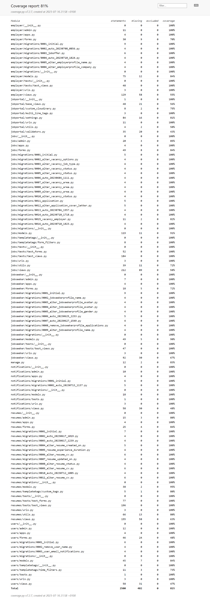

# Get Job Testing

## Table of Contents
- [Unit Testing](#unit-testing)
    * [Coverage](#coverage)
- [PEP8 - Flake8 Validation](#pep8---flake8-validation)
- [JavaScript Validation](#javascript-validation)
- [HTML Validation](#html-validation)
- [CSS Validation](#css-validation)
- [Lighthouse](#lighthouse)
    * [Desktop](#desktop)
    * [Mobile](#mobile)
- [Compatibility Testing](#compatibility-testing)
    * [Browser Compatibility](#browser-compatibility)
    * [Device Compatibility](#device-compatibility)
- [User Stories Testing](#user-stories-testing)
    * [Jobseeker](#jobseeker)
    * [Employer](#employer)
- [Bugs/Issues](#bugs/issues)

[Back to README.md](https://github.com/FlashDrag/get-job/blob/master/README.md#testing)

## Unit Testing
The unit tests were written using Django's built-in testing framework based on Python's unittest module. The tests can be found in the `tests' directory of each Django app. To run the tests automatically I used CI/CD processes with GitHub Actions. The more detailed information about the CI/CD processes can be found in the [Deployment](https://github.com/FlashDrag/get-job/blob/master/README.md#continuous-integration) section of the file.

*Django Unit Tests GitHub Actions Workflow*


### Coverage
The coverage report was generated using the [Coverage](https://coverage.readthedocs.io/) tool.
To generate the HTML report I used the following command:
```
$ coverage run manage.py test
$ coverage html
```




## PEP8 - Flake8 Validation
The Flake8 validation is used to check the Python code for PEP8 requirements. The validation is configured in the `production.yml` and `development.yml` files in the `.github/workflows` directory. The validation is run automatically with the CI/CD processes.

*Flake8 Validation GitHub Actions Workflow*


[Back to top](#table-of-contents)

## JavaScript Validation
To validate the JavaScript code I used the [JSHint](https://jshint.com/) tool. As I used single JavaScript file `script.js` for the whole website I pasted the code into the JSHint tool and validated it.


## HTML Validation
To validate the HTML code I used the [W3C Markup Validation Service](https://validator.w3.org/). The HTML code was validated for each page of the website as the app uses Django's templates to render the HTML code.

| Page | Result |
| :--- | :---: |
| Jobseeker Home | [Jobseeker Home](https://validator.w3.org/nu/?doc=https%3A%2F%2Fget-job.live%2F)
| Job Search | [Job Search](https://validator.w3.org/nu/?doc=https%3A%2F%2Fget-job.live%2Fjobs%2F)
| Job Details | [Job Details](https://validator.w3.org/nu/?doc=https%3A%2F%2Fget-job.live%2Fjobs%2F7)
| Employer Home | [Employer Home](https://validator.w3.org/nu/?doc=https%3A%2F%2Fget-job.live%2Femployer)
| Resume Search | [Resume Search](https://validator.w3.org/nu/?doc=https%3A%2F%2Fget-job.live%2Fresumes%2F)
| Resume Details | [Resume Details](https://validator.w3.org/nu/?doc=https%3A%2F%2Fget-job.live%2Fresume%2F6)


## CSS Validation
To validate the CSS code I used the [Jigsaw](https://jigsaw.w3.org/css-validator/) tool. As I used the SCSS preprocessor to write the CSS code, I validated the compiled `main.css` file that stores all the CSS code an located on the Cloudinary CDN.
<p>
    <a href="http://jigsaw.w3.org/css-validator/validator?lang=en&profile=css3svg&uri=https%3A%2F%2Fres.cloudinary.com%2Fdvj4gdxes%2Fraw%2Fupload%2Fv1%2Fstatic%2Fget-job%2Fcss%2Fmain.css&usermedium=all&vextwarning=&warning=1">
        
    </a>
</p>


[Back to top](#table-of-contents)


## Lighthouse
The Google Lighthouse tool was used to check the performance, accessibility, best practices, and SEO of the website. The tests were run on the deployed website.

### Desktop
| Page | Result |
| :--- | :--- |
| Jobseeker Home |  |
| Job Search |  |
| Job Details |  |
| Employer Home |  |
| Resume Search |  |
| Resume Details |  |

### Mobile
| Page | Result |
| :--- | :--- |
| Jobseeker Home |  |
| Job Search |  |
| Job Details |  |
| Employer Home |  |
| Resume Search |  |
| Resume Details |  |

[Back to top](#table-of-contents)

## Compatibility Testing
- ### Browser Compatibility
The game was tested on the following browsers:
    - Google Chrome
    - Mozilla Firefox
    - Microsoft Egde
The app worked well across all browsers and discrepancies were not found.

- ### Device Compatability and Responsiveness Testing
The app was tested using Google Chrome Developer Tool - Device Mode Toolbar.

Tested devices:
- iPhone SE
- iPhone 12 Pro
- Pixel 5
- Samsung Galaxy S8+
- Samsung Galaxy S20 Ultra
- iPad Air
- iPad Mini
- Surface Pro 7
- Surface Duo
- Galaxy Fold
- Samsung Galaxy A51
- Nest Hub
- Nest Hub Max
- iPad
- iPadPro

**Some results of the testing on iPhone 12 Pro**:

*Jobseeker Home*


*Job Search*


*Job Details*


*Employer Home*


*Resume Search*


*Resume Details*

[Back to top](#table-of-contents)

## Manual Testing
#### User Stories Testing


## Bugs/Issues
-

[Back to top](#table-of-contents)

[Back to README.md](https://github.com/FlashDrag/get-job/blob/master/README.md)